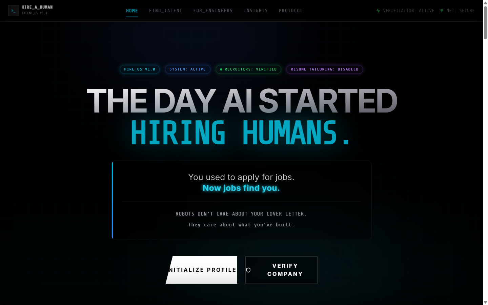
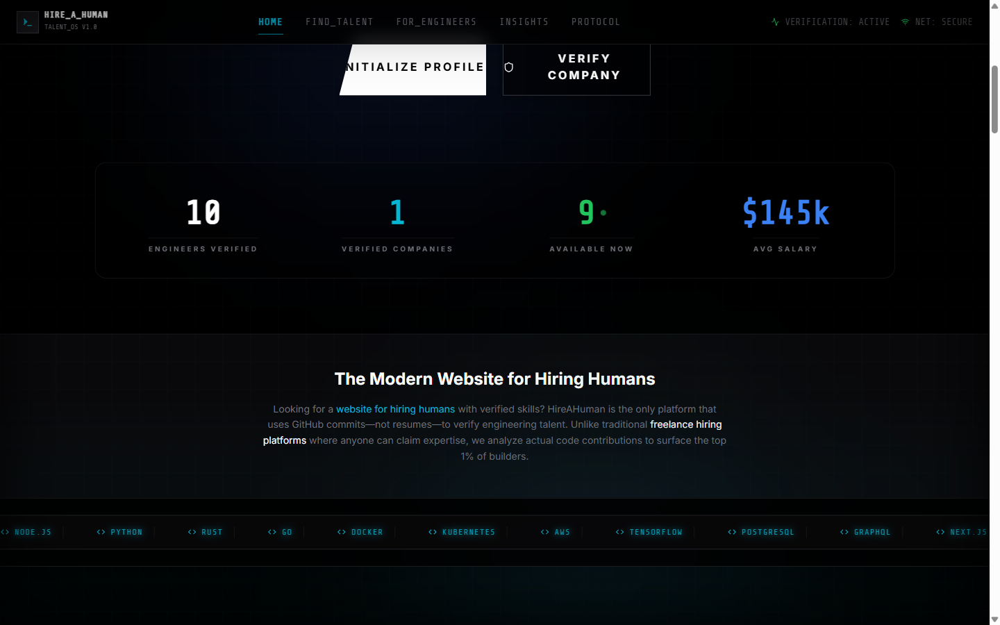
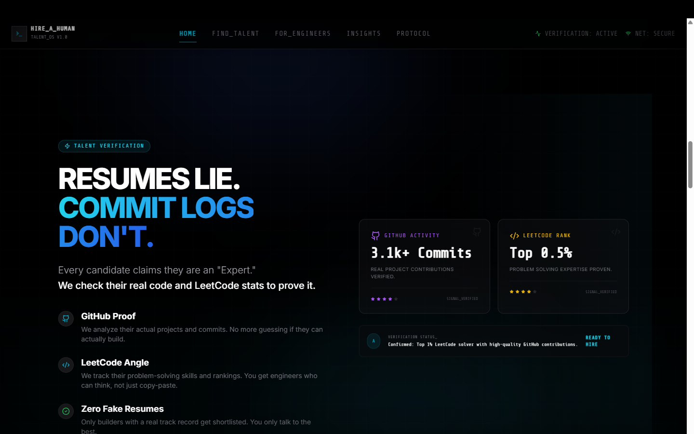

# HireAHuman.ai

The day AI started hiring humans.

HireAHuman is a live, AI-native hiring product where engineers are evaluated by proof of work, not resume theatre.

[Live Product](https://hire-a-human.app/) | [Product Hunt](https://www.producthunt.com/products/hireahuman-ai?utm_source=other&utm_medium=social) | [Launch Video](https://youtu.be/KCaputXvK5Y)

## Product First

HireAHuman is built around a simple shift:

- Candidates stop rewriting resumes for every application
- Recruiters stop reading resume spam
- AI does first-pass technical discovery from structured signals
- Humans make the final hiring decision

In production, the platform emphasizes:

- Verified company access before recruiter actions
- Candidate state lock to prevent double booking
- Profile-as-data (skills, projects, experience, job target)
- MCP-powered AI retrieval for role-to-candidate matching

## Product Screenshots

### Hero



### Talent Discovery



### Talent Verification Experience



## Product Demo

- YouTube: [Watch the launch demo](https://youtu.be/KCaputXvK5Y)

## What Makes The Product Different

1. Resume claims are de-prioritized in favor of technical proof.
2. Recruiters are verified before getting access to candidates.
3. AI assists with discovery, but decision-making stays human.
4. Hiring is modeled as system state, not just messaging workflows.

## Who This Is For

### Engineers

- Build your profile once.
- Get discovered for matching roles.
- Focus on work quality instead of resume optimization.

### Hiring Teams

- Describe the role in skills and constraints.
- Use AI-assisted discovery to shortlist faster.
- Review structured candidate signals before outreach.

## Live Feature Set

- Candidate onboarding and profile creation
- Recruiter onboarding with company verification workflow
- Admin moderation panel for verification decisions
- Talent browsing and filtering
- Dashboard-level candidate insights (including monthly profile views)
- MCP server for AI agent candidate discovery

## Architecture At A Glance

1. React + TypeScript frontend (SPA)
2. InsForge backend (auth, database, storage)
3. Python FastMCP server for AI tool interface
4. Policy-led access model with verification and role-based flows

Detailed docs:

- [Frontend.md](Frontend.md)
- [Backend.md](Backend.md)
- [AUTH_SETUP.md](AUTH_SETUP.md)
- [mcp_server/INSTRUCTIONS.md](mcp_server/INSTRUCTIONS.md)

## Local Setup

### Prerequisites

- Node.js 20+
- npm 10+
- Python 3.10+

### Install app dependencies

```bash
npm install
```

### Configure environment variables

macOS/Linux:

```bash
cp env.example .env
```

Windows PowerShell:

```powershell
Copy-Item env.example .env
```

Required keys are listed in [env.example](env.example).

### Run frontend

```bash
npm run dev
```

### Build frontend

```bash
npm run build
```

## MCP Server Setup

```bash
cd mcp_server
pip install -r requirements.txt
python server.py
```

For HTTP transport:

```bash
python server.py --transport http --port 8000
```

## Launch Release Notes (Draft)

### Version

- v1.0.0-launch

### Launch Message

- HireAHuman is now live: AI-assisted, verification-first hiring where commits matter more than claims.

### Highlights

- Live product release for engineers and hiring teams
- Candidate and recruiter pipelines available
- Verification, profile state, and hiring signal workflows active
- MCP integration available for AI-native matching workflows

### Launch Links

- Website: [https://hire-a-human.app/](https://hire-a-human.app/)
- Product Hunt: [https://www.producthunt.com/products/hireahuman-ai?utm_source=other&utm_medium=social](https://www.producthunt.com/products/hireahuman-ai?utm_source=other&utm_medium=social)
- Demo Video: [https://youtu.be/KCaputXvK5Y](https://youtu.be/KCaputXvK5Y)

## Scripts

| Script | Description |
|---|---|
| npm run dev | Start development server |
| npm run build | Type-check and production build |
| npm run lint | Lint checks |
| npm run preview | Preview production build |

## Repository

- GitHub: [https://github.com/Sanskaragrawal2107/HireaHuman.git](https://github.com/Sanskaragrawal2107/HireaHuman.git)
